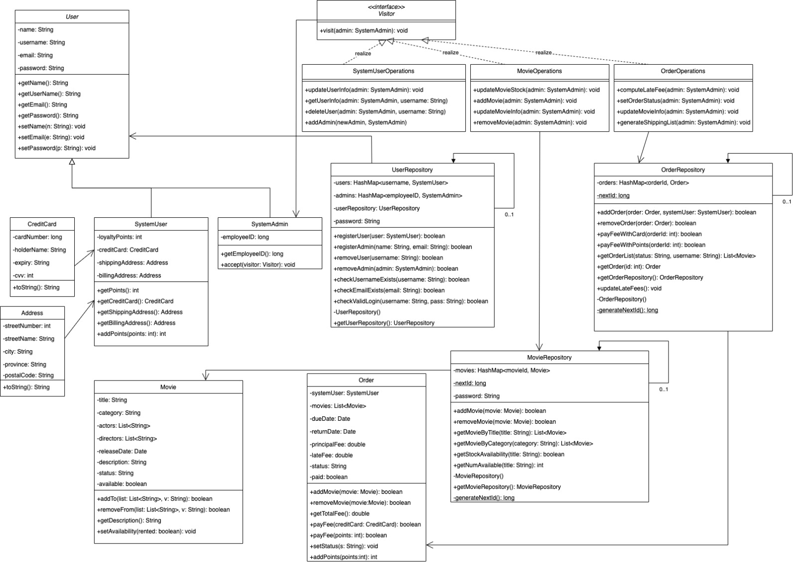

# EECS3311-Project

Task 1:

The two main design patterns that will be used in my design will be a creational and behavioural pattern. Namely: Singleton and Visitor.

The Singleton pattern will be integral for the system and design. It will help achieve the desired end-system with its use in key components of the system. The system will use the Singleton pattern in every case where it is reasonable and logical to have a single instance of a class/object to maintain system info and control. Specifically, Users, Movies and Orders in the system will be more easily maintained using the Singleton pattern.

The use of Singleton will avoid having multiple instances of these System-level classes, avoid overhead from multiple instantiation and save memory as a result.

The Visitor pattern will also be important for the system and design. In this case, the visitor pattern will allow the design of the system to maintain cohesion in the classes. Specifically, it allows for the system admin users to make system level changes and access various components of the system without violating the "do one thing and do it well" design principle.

Task 2:

The system design can be seen from the class diagram.

The following will highlight how each of the system requirements in Section 4 of the design document are met with this design.

REQ1:

UserRepository maintains a HashMap of users. In addition, in its public methods are several query methods to validate the identity and login of a user.

REQ2:

UserRepository maintains a HashMap of users. In addition, in its public methods are query methods checkUsernameExists and checkEmailExists that will help enforce unique usernames and emails.

REQ3:

MovieRepository in its public methods contains getMovieByTitle and getMovieByQuery methods that returns a list of movies that match the payload search criteria.

REQ4:

OrderRepository in its public methods contains method addOrder, which will create an Order associated with a SystemUser.

REQ5:

An Order maintains a list of movies that have been added to it. A User is able to add and remove movies to an existing order through the addMovie and removeMovie methods public in Order.

REQ6:

The OrderOperations visitor access the OrderRepository. In OrderRepository, payFeeWithCard will allow a user to pay for their order's balance with a credit card. Similarly, payFeeWithPoints will allow a user to pay with their loyalty points.

REQ7:

SystemUser's loyalty points can be incremented with its public addPoints method.

REQ8:

OrderRepository maintains and updates late fees in each Order contained with in it via its updateLateFees method that would be triggered on a 24hr timer.

REQ9:

The singleton MovieRepository has methods addMovie and removeMovie, which modifies the HashMap which serves as a movie catalogue. The stock and availability of the catalogue can be queried with getStockAvailability and getNumAvailable methods.

REQ10:

The OrderRepository creates and assigns order IDs. They are maintained by the orders HashMap.

REQ11:

The OrderRepository has look-up queries for SystemUsers to check the status of their orders. An Order object has a status attribute that can be retrieved with the public getStatus accessor.

REQ12:

The OrderRepository maintains support for creation of orders from any location. The public methods support creation of an Order and assignment of order IDs via a static nextID attribute which is incremented on each new Order creation.

REQ13:

The OrderRepository has support for removing orders via the removeOrder method. Users can remove an order as long as the Order's status is not delivered.

REQ14:

Users can set their account info using various setter methods available to it publicly at the SystemUser level, inherited from the abstract User class.

REQ15:

Users can get their account loyalty points via the public accessor getPoints available at the SystemUser level.

REQ16:

Visitor MovieOperations takes a SystemAdmin user and modifies the MovieRepository.

REQ17:

Visitor MovieOperations takes a SystemAdmin user and modifies the movies in the MovieRepository via the public methods available at the Movie level.

REQ18:

Visitor SystemUserOperations takes a SystemAdmin user and modifies the users in the UserRepository via the public methods available at the SystemUser level.

REQ19:

Visitor SystemUserOperations takes a SystemAdmin user and modifies the users in the UserRepository via the public methods available at the SystemUser level.

REQ20:

Visitor SystemUserOperations takes a SystemAdmin user and modifies the admins in the UserRepository via the public methods available at the UserRepository level.

REQ20:

Visitor SystemUserOperations takes a SystemAdmin user and modifies the admins in the UserRepository via the public methods available at the UserRepository level. The registerAdmin(email, name) method modifies the admins HashMap.

REQ21:

Visitor SystemUserOperations takes a SystemAdmin user and modifies the admins in the UserRepository via the public methods available at the UserRepository level. The removeAdmin method modifies the admins HashMap.

REQ22:

Visitor OrderOperation takes a SystemAdmin user and modifies the orders in the OrderRepository via the public methods available at the OrderRepository level. The getOrder method retrieves the order, then the status can be set with setStatus, available at the Order level.

REQ23:

OrderRepository maintains and updates late fees in each Order contained with in it via its updateLateFees method that would be triggered on a 24hr timer.

REQ24:

OrderRepository has public method getOrderList, which can be used to generate a complete list of movies for all active "not delivered" orders for a user, given a username.

REQ25:

OrderRepository has public method getOrderList, which can be used to generate a complete list of movies for all active "not delivered" orders for a user, given a username. The geographical destination implementation will be computed use the SystemUser info associated with the given order that the movies are associated to.

